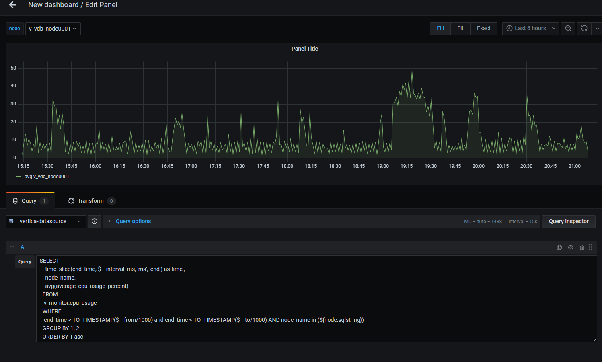

# Vertica Grafana Data Source
Grafana plugin for Vertica DB.
It defines a new data source that communicates with Vertica using the Vertica golang driver. [http://github.com/vertica/vertica-sql-go]. This plugin is a backend data source plugin.

## Using the plugin
### Adding the data source
1. Use the add data source option in grafana.

- **Name**: Data source name
- **Host**: Ip and port of vertica data base , example: <vertica-ip>:<vertica-port>
- **Database**: Database name
- **User**: User name of vertica db. Note: use a user name with less privileges. This data source doe not prevent use from executing DELETE or DROP commands.
- **Password**: password for vertica DB.
- **SSL Mode**: Three options are supported "none", "server", "server-string". This option states how the plugin connects to the data source.
- **Use Prepared Statement**: If not set, query arguments will be interpolated into the query on the client side. If set, query arguments will be bound on the server. (Honestly we do not use it, it was a part of connection string so added it to the UI. Its passed to the driver though.)
- **Use Connection Load balancing**: If set the query will be distributed to vertica nodes
- **Set Max Open Connection**, **Ideal Connections** and **Max connection ideal time**
2. Save and test the data source.
For testing the connectivity "select version()" query is executed on the database.

### Querying data.
Data is returned in Data frame format.   
To lean more about data frames please refer. https://grafana.com/docs/grafana/latest/developers/plugins/data-frames/#data-frames

- Time series queries.   
Query type supported are time series and table. Can be changed using the drop down in the query editor.   
Example Time Series Query:   
~~~~sql
SELECT 
  time_slice(end_time, $__interval_ms, 'ms', 'end') as time , 
  node_name,
  avg(average_cpu_usage_percent)
FROM 
  v_monitor.cpu_usage 
WHERE 
  end_time > TO_TIMESTAMP($__from/1000) and end_time < TO_TIMESTAMP($__to/1000)
GROUP BY 1, 2
ORDER BY 1 asc
~~~~

No macros are used in the data source. Instead grafana global variables are used.   
Example: "time_slice(end_time, $__interval_ms, 'ms', 'end') as time" following statement helps the quey to honor the interval of visualization. $__interval_ms is a grafana global variables.   
Time filter:   
Example: "end_time > TO_TIMESTAMP($__from/1000) and end_time < TO_TIMESTAMP($__to/1000)"  this convert the the global $__from and $__to variables from grafana, to a timestamp format for vertica.   


Table Query:
~~~~sql 
SELECT 
  time_slice(end_time, $__interval_ms, 'ms', 'end') as time , 
  node_name,
  avg(average_cpu_usage_percent)
FROM 
  v_monitor.cpu_usage 
WHERE 
  end_time > TO_TIMESTAMP($__from/1000) and end_time < TO_TIMESTAMP($__to/1000)
GROUP BY 1, 2
ORDER BY 1 asc
~~~~
Select the drop down as table to visualize.

Visualization:


### Variables:
Variables can be easily defined as sql queries, the only restriction is query should return at least one column with "**_text**" name.
If the query has two columns "**_text**" and "**_value**", **_text** would be used as the display value and **_value** would be applied to filter.

Example:

Query:
~~~~sql 
select distinct node_name as '_text' from v_monitor.cpu_usage 
~~~~


Usage:
Grafana [Advanced formatting options]https://grafana.com/docs/grafana/latest/variables/advanced-variable-format-options/.
In this example we create a multi select variable of node name , use ${node:sqlstring} for template in the query. 


## Annotations

Annotations are supported from grafana 7.2+   


To use annotations, write any query which will return time, timeEnd, text, title and tags column as shown in the image.   

## Streaming (new)
Added support for streaming


Example Query
```SQL
  SELECT 
    end_time as time , 
    avg(average_cpu_usage_percent)
  FROM 
   v_monitor.cpu_usage 
  WHERE 
   end_time > TIMESTAMPADD(MINUTE, -1 , CURRENT_TIMESTAMP)
  GROUP BY 1
  ORDER BY 1 asc
```
This will get the latest data from the data base and keep appending the samples.

## Time gap filling (new)
SQL data can return data which do not have sample for the entire time range , e.e you could haves gaps in the data.    
In the new time gap filling we provide two modes , it will add the missing time rows , with either null or static values.   
There are two modes **static**, **null**. More modes would come in future.


## SQL syntax highlighting (new)
SQL syntax highlighting added using CodeMirror library. In future would add auto complete and formatting.

## Debugging

You can debug the backed code using dlv.
In order to debug the code.
1. Compile the backend code with debug options.
```BASH 
mage -v debugger
```
2. Restart grafana server
```BASH 
systemctl restart grafana-server
```
3. Get the pid of the plugin process 
```BASH 
pgrep vertica
```
4. Use the pid from 3 step and use it in the below statement to start debugger
```BASH 
dlv attach <"pid from step 3"> --headless --listen=:3222 --api-version 2 --log
```
5. Now you can use the vscode and debug option , configuration debugging is present in launch.json

## Development

Prerequisite
 1. Node JS 14+
 2. Go version 1.14+
 3. yarn

Install
```BASH
yarn install
```
Build
 1. **Frontend** 
    ```BASH
    yarn build
    ``` 
 2. **Backend** mage -v
    ```BASH
    mage -v
    ``` 

## Testing
 ```BASH
sudo docker-compose up
```
This will run a local vertica and grafana instance.   
A data source and data source will already be provisioned.    


