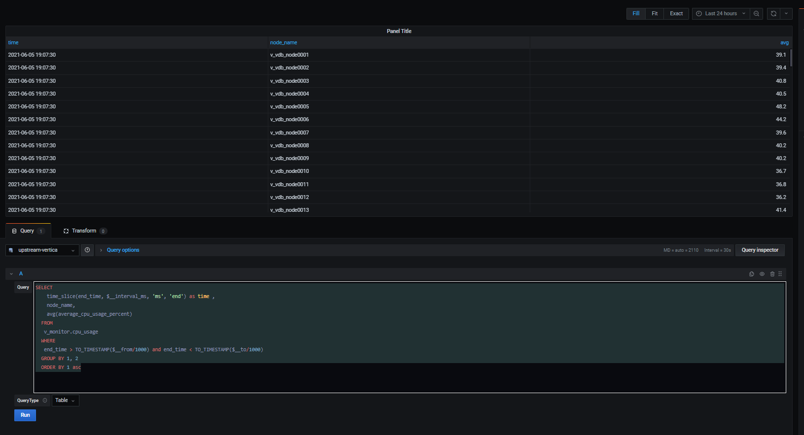
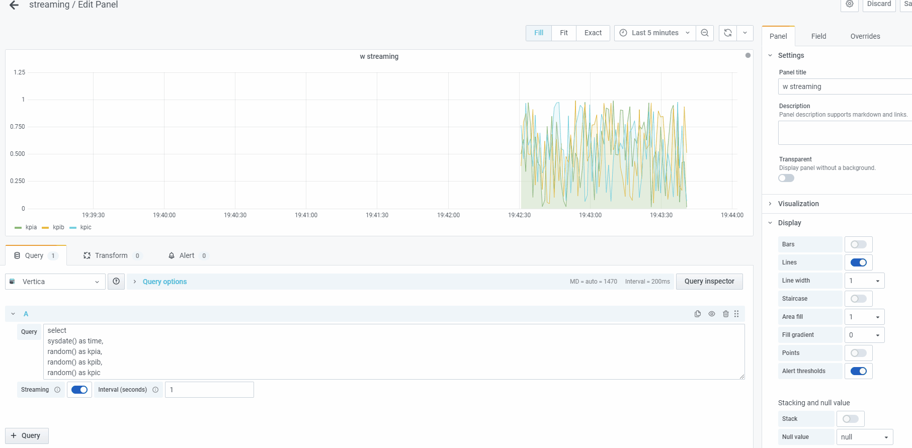

# Vertica Grafana Data Source
This is a work-in-progress Grafana plugin to support the Vertica database.

It defines a new datsource that communicates with Vertica using the Vertica golang driver. [http://github.com/vertica/vertica-sql-go]. This pulugin is a backend data source plugin.

## Installtion
As of now this plugin is not singed , so you will have to clone the repo and then build it.
Steps to install the plugin.
### Prerequisite
You should have 
1. Node 12.x installed.
2. Yarn installed.
3. Golang installed.
4. Mage installed.
### Building the plugin
1. Clone the repo to the grafana plugins director.
```BASH 
git clone https://github.com/vertica/vertica-grafana-datasource.git
cd vertica-grafana-datasource
```
2. Frontend install and build.
```BASH 
yarn install
yarn build
```
3. Backend install and build.
```BASH 
mage -v
```
3. Change the grafana.ini to allow un singed plugin.
Under the plugins section, uncomment the allow_loading_unsigned_plugins line and add vertica-grafana-datasource. 
```BASH 
[plugins]
;enable_alpha = false
;app_tls_skip_verify_insecure = false
# Enter a comma-separated list of plugin identifiers to identify plugins that are allowed to be loaded even if they lack a valid signature.
allow_loading_unsigned_plugins = rajsameer-vertica-datasource
;marketplace_url = https://grafana.com/grafana/plugins/
```
4. Restart grafana to load the plugin.
You might require sudo privileges
```BASH 
systemctl restart grafana-server
```


## Using the plugin
### Adding the data source
1. Use the add data source option in grafana.

- Name: Data source name
- Host: Ip and port of vertica data base , example: <vertica-ip>:<vertica-port>
- Database: data base name
- User: User name of vertica db. Note: use a user name with less privileges. This data source doe not prevent use from executing DELETE or DROP commands.
- Password: password for vertica DB.
- SSL Mode: Three options are supported "none", "server", "server-string". This option states how the plugin connetes to the data source.
- Use Prepared Statement: If not set, query arguments will be interpolated into the query on the client side. If set, query arguments will be bound on the server.
- Use Connection Load balancing: If set the query will be distrubted to vertica nodes
- Set Max Open Connection, Ideal Connections and Max connection ideal time
2. Save and test the data source.
For testing the connectivity "select version()" query is executed on the database.

### Querying data.
1. This plugin uses the new backedn plugin model of grafana. Which means the data data returned from the backed is Data frame.
To lean more about data frames please refer. https://grafana.com/docs/grafana/latest/developers/plugins/data-frames/#data-frames

- Time series queries.
The user does not need to specefiy explicitly the query type.
If a query has single time column , then the query is considered as time series.
Time Series Query:
~~~~sql
SELECT 
time_slice(end_time, $__interval_ms, 'ms', 'end') as time , 
node_name,
avg(average_cpu_usage_percent)
FROM 
v_monitor.cpu_usage 
WHERE 
end_time > TO_TIMESTAMP($__from/1000) and end_time < TO_TIMESTAMP($__to/1000)
GROUP BY 1, 2
ORDER BY 1 asc
~~~~

We have specefically node used any macros that get implemneted in the backed, Most of the transformation is done using Vertica SQL function and grafana global variables.
Example: "time_slice(end_time, $__interval_ms, 'ms', 'end') as time" following statment helps the quey to honor the intreval of visulization. $__interval_ms is a grafana global variables.
Time filter: 
Example: "end_time > TO_TIMESTAMP($__from/1000) and end_time < TO_TIMESTAMP($__to/1000)"  this convert the the global $__from and $__to variables from grafana, to a timestamp format for vertica.

Visualization:


Table Query:
~~~~sql 
select 
distinct 
node_name,
error_level,
message
from v_monitor.ERROR_MESSAGES
where event_timestamp > sysdate() -1/24 and error_level != 'INFO'
~~~~
Any query without time column is returned as in a Long format and can be esily visualized as a table.

Visualization:


### Variables:
Varibales can be esily defined as sql queries, the only restriction we have is query shoyld return at least one column with "_text" name.
If the query has two columns "_text" and "_value", _text would be used as the display value and _value would be applied to filter.

Example:

Query:
~~~~sql 
select distinct node_name as '_text' from v_monitor.cpu_usage 
~~~~


Usage:
You can use the grafana [Advanced formating options]https://grafana.com/docs/grafana/latest/variables/advanced-variable-format-options/.
In this example we create a multi select variable of node name , use ${node:sqlstring} for templating in the query. 


## Annotations

Annotaions are supported from grafana 7.2+


Inorder to use annotations, you can write any wuery which will return time, timeEnd, text, title and tags column as shown in the image.
And you are good to go

## Streaming (new)
Added support for streaming



Example Query
```SQL
  SELECT 
    end_time as time , 
    avg(average_cpu_usage_percent)
  FROM 
   v_monitor.cpu_usage 
  WHERE 
   end_time > TIMESTAMPADD(MINUTE, -1 , CURRENT_TIMESTAMP)
  GROUP BY 1
  ORDER BY 1 asc
```
This will get the latest data from the data base and keep appending the samples.

## Debugging

You can debugg the backed code using dlv.
In order to debugg the code.
1. Compile the backend code with debug options.
```BASH 
mage -v debugger
```
2. Restart grafana server
```BASH 
systemctl restart grafana-server
```
3. Get the pid of the plugin process 
```BASH 
pgrep vertica
```
4. Use the pid from 3 step and use it in the below statment to start debugger
```BASH 
dlv attach <"pid from step 3"> --headless --listen=:3222 --api-version 2 --log
```
5. Now you can use the vscode and debug option , configuration debugging is present in launch.json

## Devlopment

Prerequisite
 1. Node JS 14+
 2. Go version 1.14+
 3. yarn

Install
```BASH
yarn install
```
Build
 1. **Frontend** 
    ```BASH
    yarn build
    ``` 
 2. **Backend** mage -v
    ```BASH
    mage -v
    ``` 

## Testing
 ```BASH
sudo docker-compose up
```
This will run a local vertica and grafana instance.
A data source and data source will already be provisend 


